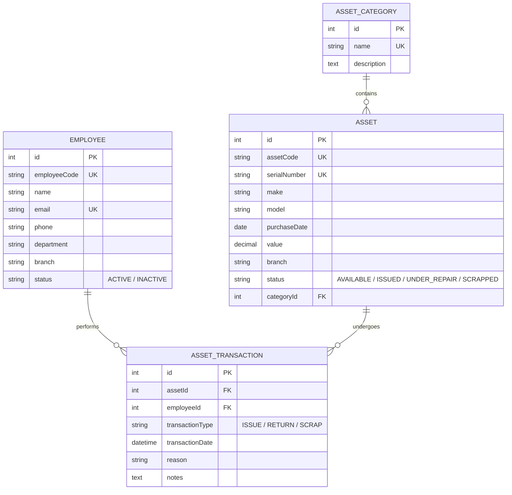

# 📦 Premium Asset Management System

A modern, full-featured **Asset Management System** built with Node.js, Express, Sequelize ORM, PostgreSQL, and Pug template engine. The application provides a complete lifecycle tracking for corporate physical assets—from category classification and employee assignment to maintenance, returns, and retirement (scrapping).

---

## ✨ Features

- **👥 Employee Directory**: Complete management of employee records, track contact details, departments, branches, and status (`ACTIVE` / `INACTIVE`).
- **🏷️ Asset Category Management**: Organize assets into distinct categories (e.g., Laptops, Mobile Phones, Printers, Furniture) with custom descriptions.
- **💻 Physical Asset Cataloging**: Track individual assets with details like unique asset codes, serial numbers, make/model, purchase date, monetary value, branch location, and current state.
- **🔄 Transaction Lifecycle Management**:
  - **Issue Asset**: Assign available assets to active employees with audit notes.
  - **Return Asset**: Process returns with specific reason tags (e.g., *Upgrade, Repair, Resignation*) and update asset status accordingly.
  - **Scrap Asset**: Retire damaged or obsolete assets from the active inventory.
- **📊 Stock & Inventory Dashboard**: Real-time stock status monitoring, branch-wise asset counts, total financial value aggregation, and instant search filtering.
- **🎨 Premium Visual Experience**: Styling driven by the **Inter** font family, deep-blue gradient header bars, high-contrast status badges, subtle hover micro-animations, and integrated interactive tables via **DataTables**.

---

## 🏛️ System Architecture

The database schema utilizes relational constraints and foreign keys to ensure data integrity across employees, asset categories, physical assets, and transaction logs.



---

## 🚀 Getting Started

### Prerequisites
Make sure you have the following installed on your machine:
- [Node.js](https://nodejs.org/) (v16.x or higher recommended)
- [Docker & Docker Compose](https://www.docker.com/) (to run the PostgreSQL database locally)

---

### Step 1: Environment Configuration
Create a `.env` file in the root of the project and define your PostgreSQL connection details. A default template is provided below:

```ini
DB_HOST=localhost
DB_PORT=5433
DB_NAME=asset_management
DB_USER=postgres
DB_PASSWORD=postgres
```

---

### Step 2: Spin Up the Database
This project includes a `docker-compose.yml` file to instantly set up a PostgreSQL 16 container pre-configured with the default ports and credentials listed in the environment config.

Run the following command in the root directory:
```bash
docker compose up -d
```

---

### Step 3: Install Dependencies
Install all required Node modules:
```bash
npm install
```

---

### Step 4: Run the Application
Start the development server with hot-reloading powered by `nodemon`:

```bash
npm run dev
```

Alternatively, start the server in production mode:
```bash
npm start
```

Once started, open your browser and navigate to **[http://localhost:3001](http://localhost:3001)**. The application will automatically synchronize the Sequelize schemas and create database tables if they do not exist.

---

## 📁 Directory Structure

```text
asset-management/
├── config/
│   └── database.js          # Sequelize connection configuration
├── controllers/
│   ├── AssetCategoryController.js # Category operations
│   ├── AssetController.js         # Asset cataloging
│   ├── EmployeeController.js      # Employee registry
│   ├── StockController.js         # Aggregations & inventory views
│   └── TransactionController.js   # Issuance, return, and scrap logs
├── models/
│   ├── Asset.js             # Asset model & associations
│   ├── AssetCategory.js     # Category model
│   ├── AssetTransaction.js  # Transaction audit model
│   └── Employee.js          # Employee model
├── public/                  # Static assets (images, stylesheets)
├── routes/
│   ├── assetCategoryRoutes.js
│   ├── assetRoutes.js
│   ├── employeeRoutes.js
│   ├── stockRoutes.js
│   └── transactionRoutes.js
├── views/                   # Pug layouts & components
│   ├── assets/              # Asset views (index, create, edit)
│   ├── categories/          # Category views
│   ├── employees/           # Employee views
│   ├── stock/               # Real-time stock status table
│   ├── transactions/        # Issue, return, and scrap forms
│   ├── home.pug             # Dashboard home view
│   └── layout.pug           # Main layout containing styles & script tags
├── .env                     # Local environment configurations
├── app.js                   # Application entry point & route mounting
├── docker-compose.yml       # Docker database configuration
├── package.json             # Scripts & library dependencies
└── README.md                # Project documentation
```

---

## 🔗 Route Map & Endpoints

| Resource Group | Path | HTTP Method | Action / Purpose |
| :--- | :--- | :--- | :--- |
| **Home** | `/` | GET | Render home page overview and quick actions |
| **Employees** | `/employees` | GET | List all employees |
| | `/employees/create` | GET / POST | Render form / Create a new employee |
| | `/employees/edit/:id` | GET / POST | Render form / Update employee record |
| | `/employees/toggle-status/:id` | POST | Activate/Deactivate employee |
| **Categories** | `/categories` | GET | List all asset categories |
| | `/categories/create` | GET / POST | Render form / Create category |
| | `/categories/edit/:id` | GET / POST | Render form / Update category |
| **Assets** | `/assets` | GET | List all physical assets |
| | `/assets/create` | GET / POST | Render form / Catalog new asset |
| | `/assets/edit/:id` | GET / POST | Render form / Edit asset details |
| **Stock** | `/stock` | GET | View inventory aggregates and branch metrics |
| **Transactions** | `/transactions/issue` | GET / POST | Render form / Issue asset to employee |
| | `/transactions/return` | GET / POST | Render form / Return issued asset |
| | `/transactions/scrap` | GET / POST | Render form / Scrap physical asset |
